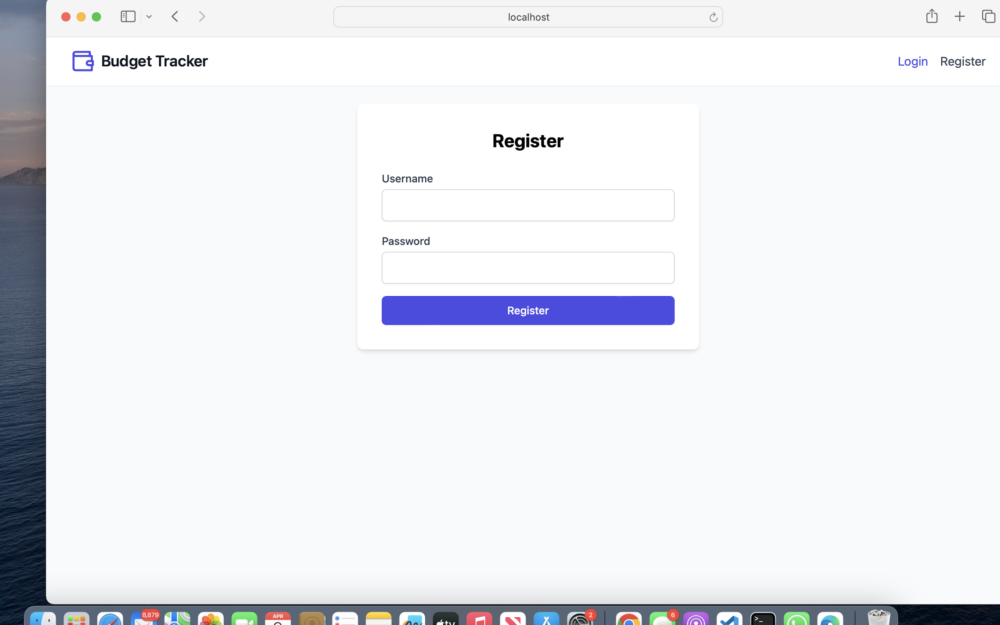
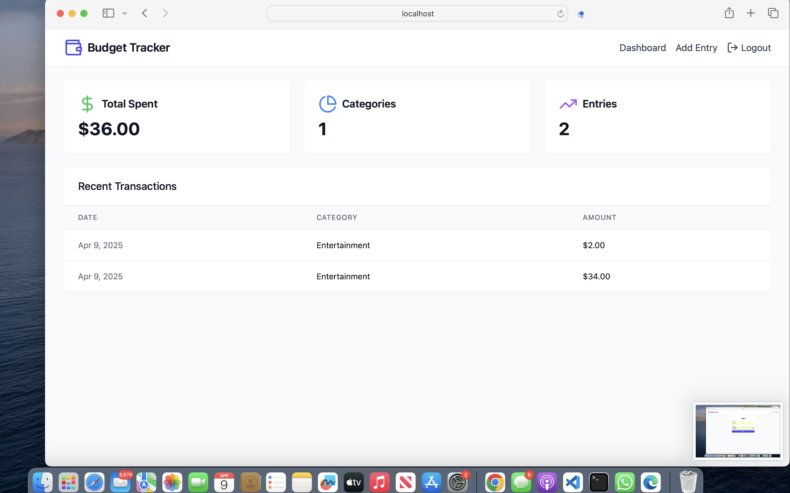

# Budget Tracker App

A simple budget tracking application built with Flask and SQLite.

## 📸 App Screenshots

### 🏠 Login


### 📊 Dashboard



## Technologies Used

- Python 3  
- Flask  
- SQLAlchemy (ORM)  
- SQLite (for local testing)  
- React Frontend/ CSS
---

## Installation

### 1. Clone the Repository

```bash
git clone https://github.com/liibaand/budget-tracker.git
cd budget-tracker
```
---

### 2. Create and Activate a Virtual Environment
  -Make sure to use to activate virtual environment before running app

```bash
python3 -m venv venv
source venv/bin/activate  # On Windows: venv\Scripts\activate
```

---

### 3. Install Dependencies

```bash
pip3 install -r requirements.txt
```

---

### 4. Run the Application

```bash
python3 app.py
```

The API will be available at:  
`http://127.0.0.1:5000/`

`cd frontend
npm install
npm start`


---

## Folder Structure

```
budget-tracker/
│
├── backend/
│   ├── app.py
│   ├── models.py
│   ├── config.py
│   ├── tests
│
├── frontend/
│   ├── public 
│   ├── src
│
├── requirements.txt
├── README.md
└── .gitignore

```

---

## API Endpoints

### `POST /add`
```
Add a new budget entry.
```
**Request Body (JSON):**
```json
[
    {
      "category": "Food",
      "amount": 25.00,
      "date": "2025-04-07"
    },
  {
    "message": "Entry added successfully!"
  }
]

```
---
### `Get /entries`

Retrieves all budget entries.
```json
[
  {
    "category": "Food",
    "amount": 25.00,
    "date": "2025-04-07"
  },
  {
    "category": "Food",
    "amount": 25.00,
    "date": "2025-04-07"
  }
]
```
---
## License

This project is licensed under the MIT License - see the [LICENSE](LICENSE) file for details.
```
